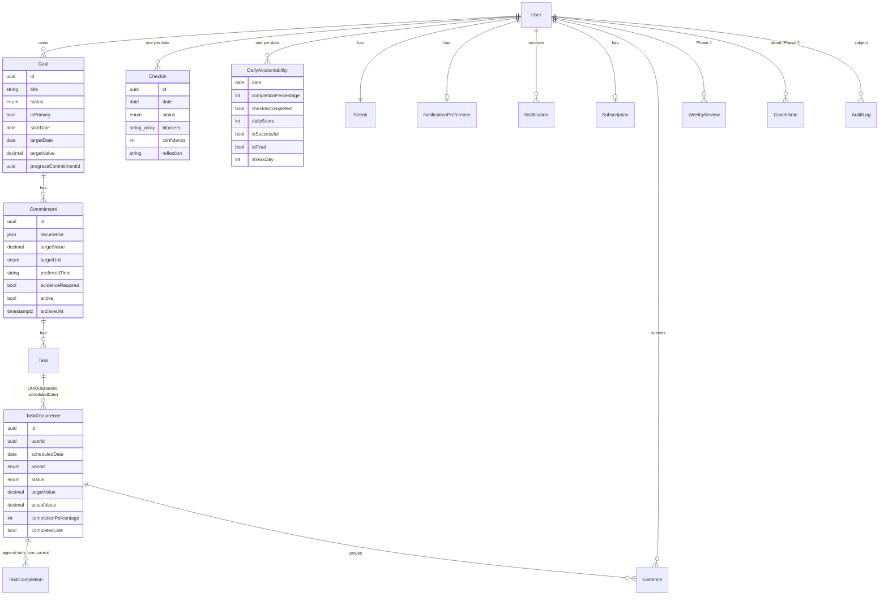

# Architecture

```
Browser ──► static site (Cloudflare Pages / CDN) ──Pages Function /api/v1/*──► NestJS API ──► PostgreSQL (Prisma)
   │                                                                              │   ├─ job queue (SKIP LOCKED) + scheduler
   └──────────── signed PUT / GET ─────────────► Cloudflare R2 (private) ◄────────┘   └─ (no Redis)
```

* The browser only talks to the web origin. `/api/v1/*` is proxied (Next rewrite in dev, Cloudflare Pages Function in production), so the session cookie is first-party and no CORS is needed.

## Rendering (web)

Every route is pre-rendered at build time (SSG, `output: 'export'`); per-user data loads in the browser through TanStack Query. There is no SSR: the app is private and personalised (no SEO), and static files on a CDN are free, fast and have no cold starts. Consequences: no middleware (the client `RequireSession` guard decides what to render; the API enforces access), ids in query strings (`/app/goals/detail?id=`), security headers via `out/_headers`. Structure and rules: `docs/engineering-rules.md`.
* **All business rules live in the API.** React components only render server state (TanStack Query) and collect input.
* API layering: controller (thin, DTO validation) → service (rules, transactions) → repository / Prisma. Pure rules live in `src/domain` with no I/O so they are trivially unit-testable.

## Core concepts

| Concept | Meaning |
|---|---|
| **Goal** | The outcome (“Get a software engineering job”). Never completed automatically. |
| **Commitment** | A repeated promise with a recurrence and a measurable target (“Apply to 5 jobs, daily”). |
| **Task** | The actionable unit under a commitment (one default task per commitment in the MVP; archived when the occurrence shape changes). |
| **TaskOccurrence** | One task on one local date (or one ISO week for “N× per week”). Snapshots title/target/unit/evidence at generation. |
| **TaskCompletion** | Append-only log of completion updates; exactly one `isCurrent` row (partial unique index). |
| **CheckIn** | One per user per local date. Separate from task completion. |
| **DailyAccountability** | Materialised per-day result used by streaks, calendar and analytics. |

## Timezones

* Instants (`createdAt`, `scheduledStartTime`, `completedAt`, …) are `timestamptz` in UTC.
* “Which day is it?” is always `todayIn(user.timezone)` (Luxon). Accountability dates are `DATE` columns in the user’s local calendar.
* Check-in schedule per day: reminder at `checkInTime`, follow-up at +60 min, close at local 23:59:59.999. DST is handled by Luxon (see unit tests).

## Occurrence generation (idempotent)

```
for each active commitment of an ACTIVE goal, not archived, within start/end dates:
  if TIMES_PER_WEEK → one WEEK occurrence (scheduledDate = Monday)
  else if not a rest day and rule applies to date → one DAY occurrence per task
createMany(skipDuplicates) — UNIQUE(taskId, scheduledDate) makes repeats no-ops
```

Triggered by (a) the Postgres job queue: a `tick` job every minute (dedupe key `tick:<minute>`, safe across instances) fans out one `user-maintenance` job per user per 15-minute slot (`maint:<user>:<slot>`), (b) `catchUp()` on dashboard / tasks / check-in loads (memoised for 30 s per user), (c) goal/commitment creation. If workers are down the app stays correct.

## Job queue

`Job` rows are claimed with `UPDATE … WHERE id IN (SELECT … FOR UPDATE SKIP LOCKED)`, so any number of API instances can work the queue without double-processing. Failures retry with exponential backoff (30 s → 2 h cap) and become `DEAD` after `maxAttempts`; a RUNNING job whose worker vanished is reclaimed after 5 minutes. The scheduler writes a heartbeat that `/health` (and the Cloudflare cron watchdog) check.

## Evidence uploads

1. Browser compresses images to WebP (≤ 1600 px + 320 px thumbnail; EXIF/GPS removed).
2. `POST /evidence/uploads` checks ownership, type, size, per-task (5) and per-user (200 MB) limits, and returns short-lived signed PUT URLs for random keys (`ev/<user>/<random>.webp`).
3. The browser PUTs bytes directly to R2 (or the API's signed local endpoint in development).
4. `POST /evidence` confirms: the stored object's size and first bytes must match the declared type; then the Evidence row, audit log and day recompute commit in one transaction. Mismatches delete the object.
5. Views use 10-minute signed GET URLs. A job deletes objects from abandoned uploads.

`catchUp()` also closes any unclosed past day (up to 14 days back): pending → MISSED (only after the scheduled end), partially-done → PARTIAL, unsubmitted check-in → MISSED + a non-shaming notification, then finalises the day and recomputes the streak.

## Scoring & streaks (deterministic)

```
dailyScore = taskCompletion·0.50 + checkIn·0.20 + commitmentAdherence·0.20 + evidence·0.10
```

* taskCompletion = mean completion % (partial credit); commitmentAdherence = % fully completed; checkIn = 100 if submitted (on time or late); evidence = % of evidence-required tasks with evidence. When nothing requires evidence that weight is not applicable and the remaining weights are re-normalised.
* Successful day = completion ≥ 80 % **and** check-in completed.
* Streak is **derived** from stored daily results every time: success extends, a planned non-rest day that failed breaks it, rest days / empty days are neutral, and an unfinished today never breaks it. Nothing is ever deleted; the previous streak length is kept for recovery messaging.
* Weekly score = mean daily score over active days. An unfinished today is excluded from week/month aggregates until it is checked in.

## Data consistency

Every multi-record mutation runs in one transaction (`PrismaService.tx`): e.g. completing a task updates the occurrence, rotates the current `TaskCompletion`, writes the audit log, recomputes the day and the streak. History is immutable: commitment edits only affect today’s **untouched** occurrence and future ones.

## Security

* bcrypt (12), JWT in httpOnly/SameSite=Lax/Secure(prod) cookie, `tokenVersion` revocation, session re-validated against the DB each request.
* CSRF: SameSite cookie + mandatory `X-Requested-With: accountability-web` header on mutations + Origin allow-list.
* Ownership: every query is scoped by `userId` (occurrences carry a denormalised `userId`); foreign IDs return 404. Covered by integration tests.
* Validation: global `ValidationPipe` with `whitelist` + `forbidNonWhitelisted` (no mass assignment), UUID param pipes.
* Rate limiting (`@nestjs/throttler`): global 300/min, auth 10/min per IP. `trust proxy` set for correct client IPs.
* Helmet headers on the API; CSP, frame-deny, nosniff, referrer and permissions policies on the web app.
* Errors: `{ success:false, error:{ code, message } }`; no stack traces or SQL in production. Logs are JSON with password/token/URL/reflection redaction.
* Uploads: jpg/png/webp/pdf only, ≤ 10 MB, the stored object's magic bytes must match the declared type, random 192-bit keys, single-use signed upload URLs (15 min), files served only via 10-minute signed URLs with `nosniff` + sandbox CSP.
* Every request carries an `X-Request-Id` (echoed in error bodies and logs). Rate limits key on `CF-Connecting-IP` when `TRUST_CLOUDFLARE=true`.

## Mentoring

Roles: **USER** (client, signs up), **MENTOR** (invite-only), **ADMIN** (created by `npm run create-admin`). Each role has its own area — `/app`, `/mentor`, `/admin` — chosen after sign-in from the role stored in the database.

* **Choosing a mentor (self-service).** On the Goals page a client browses the mentor directory (`GET /me/mentors`): mentors who accept clients and have a headline or bio, sorted by free spots and by how well their focus areas match the client's goal categories. Choosing (`POST /me/mentor/choose`) is the client's consent, so the assignment starts ACTIVE and the mentor is notified with the client's optional intro. A per-client and a per-mentor advisory lock make concurrent choices safe: a mentor never gets more clients than their capacity. Switching mentor ends the old link exactly like "stop sharing" (calls cancelled, rules off) without alerting admins. Choosing the mentor an admin proposed simply accepts that proposal.
* **Assignment by an admin.** An admin can also link a mentor and a client (`MentorAssignment`: PENDING → ACTIVE → ENDED). A partial unique index guarantees one open assignment per client; an advisory lock serialises capacity checks. A mentor sees a pending client's name only. Reassigning, unassigning, the client's "stop sharing" or deactivation ends the link in one transaction: future sessions are cancelled, their queued reminders deleted and nudge rules switched off. Access stops on the mentor's next request.
* **Single access path.** `MentorAccessService` is the only way mentor code loads a client (rule 34a). Admins can read any client; actions (sessions, nudges, rules, action items) need the assigned mentor.
* **Board status** (`domain/mentoring.ts`, unit tested): *Inactive* — no activity for 3+ days; *Needs attention* — 3 active days in a row under 60 %, or yesterday's check-in missed; *Watch* — a missed check-in or a day under 50 % in the last 3 days; otherwise *On track*. Computed for many clients with a constant number of queries from `DailyAccountability`.
* **Toolkit.** Sessions (`MentorSession`, weekly series), prep sheet with rule-based talking points, versioned notes (`MentorNote` + append-only `MentorNoteVersion`; drafts autosave unversioned), action items, nudges with templates (3 per client per local day, quiet 22:00–07:00 client time, under a per-client advisory lock), automatic nudge rules, weekly reports, timeline, "My day", admin mentor activity.
* **Background work** rides the existing queue: session reminders are jobs keyed `session-reminder:<id>:<startsAt>:<lead>:<who>` (a moved or cancelled session makes old jobs no-ops); the 15-minute per-user pass also runs nudge rules, nudge-response tracking, Monday weekly reports, client alerts to the mentor (one per client per day, mentor daytime only), the mentor's morning summary (08:00–12:00 local) and follow-up reminders.
* **Delivery.** Every notification is an in-app row; when VAPID keys are set, a `push` job sends it with Web Push (`public/sw.js`), deleting endpoints the push service reports gone. WhatsApp is click-to-chat (`wa.me`) from the mentor's phone, only after the client opts in; the WhatsApp Business API is a later phase.

## ERD


